# OEOS Plugin (SillyTavern Extension)

English | [简体中文](README_CN.md)

A SillyTavern extension that transforms AI conversations into interactive OEOS game experiences.

**⚠️ Warning**

**This project is currently in a very early stage. Features are incomplete, and there may be many unforeseen bugs. Furthermore, all code in this project is AI-generated and is intended for technical validation and communication purposes only. Please use with caution.**

Most of the content in this document, including this one, is also AI-generated.


Currently, it doesn't handle how to make AI include images and audio, so only text-based gameplay is supported.


## Table of Contents

- [What is OEOS?](#what-is-oeos)
- [What is "AI-based OEOS"?](#what-is-ai-based-oeos)
- [Installation](#installation)
- [How It Works](#how-it-works)
- [Core Module Description](#core-module-description)
- [Project Structure](#project-structure)
- [Build Instructions](#build-instructions)
- [Acknowledgments](#acknowledgments)

## What is OEOS?

**OEOS (Erotic Obedience Scripting)** is an interactive script format originally used on the Milovana platform, capable of creating interactive content with rich elements such as dialogue, choices, images, audio, video, timers, and more.

**openOEOS** is an open-source OEOS player developed by fapnip that can run OEOS scripts in a browser.

## What is "AI-based OEOS"?

This plugin integrates the openOEOS player into SillyTavern and implements an innovative feature:

- **AI Auto-generates OEOS Content**: Large Language Model (LLM) responses are automatically parsed into OEOS pages and summaries
- **Persistent Storage**: Generated content is saved to the character's World Info and can be loaded and continued at any time
- **Visual Interaction**: Rendered through the openOEOS player, providing a graphical game experience
- **Smart Pre-generation**: Supports concurrent pre-generation of multiple pages to improve experience fluidity


## Installation


### Prerequisites

1. **Install Tavern Helper**
   - Please ensure the "Tavern Helper" plugin is installed first
   - Reference link: https://n0vi028.github.io/JS-Slash-Runner-Doc/


2. **Install SPreset Script**
   - Install 【SPreset - Built-in Regex for Presets | Macro Nesting...】 from "Tavern Helper Scripts"
   - Reference link: https://discord.com/channels/1134557553011998840/1407146985643053096

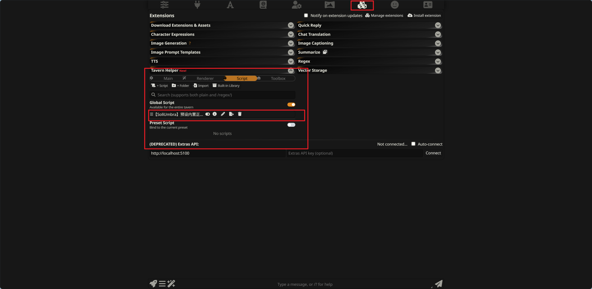
3. **Import Preset File**
   - Import `oeos-st-extension/小猫之神-oeos.json` into SPreset in "Tavern Helper"

   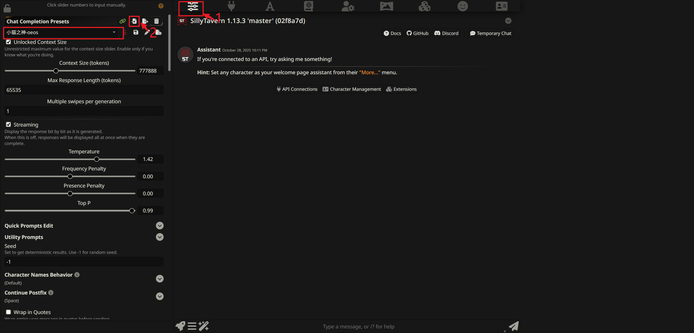
   - Thanks to preset author: 小猫之神
   - Reference link: https://discord.com/channels/1134557553011998840/1402584661208858635


### Install Extension

1. Copy oeos-st-extension to your SillyTavern installation directory:
   ```
   SillyTavern/public/scripts/extensions/third-party/oeos-st-extension/
   ```
   Like this:
   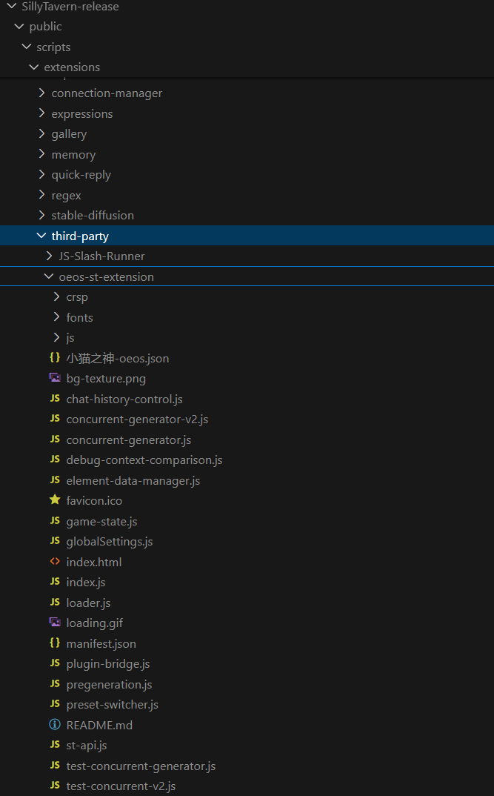

2. Restart SillyTavern

3. Enable "OEOS Interface" in "Extension Management > Third-party Extensions"\\


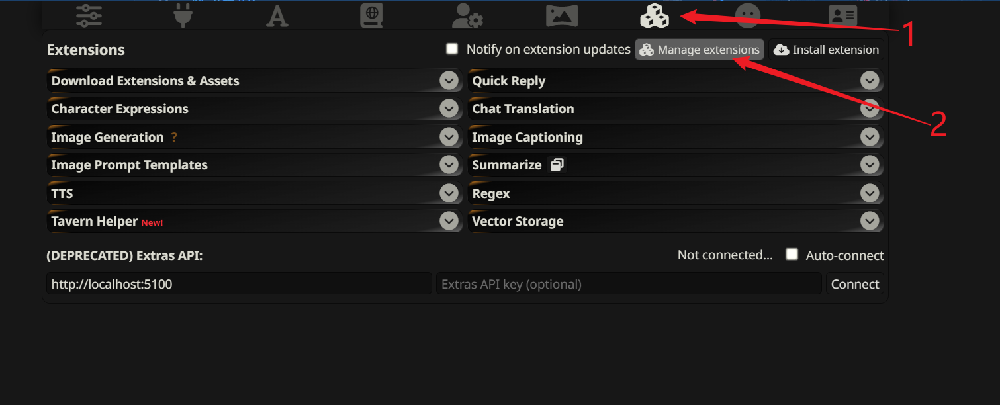

Now you should see the 🚀 button next to the input box.
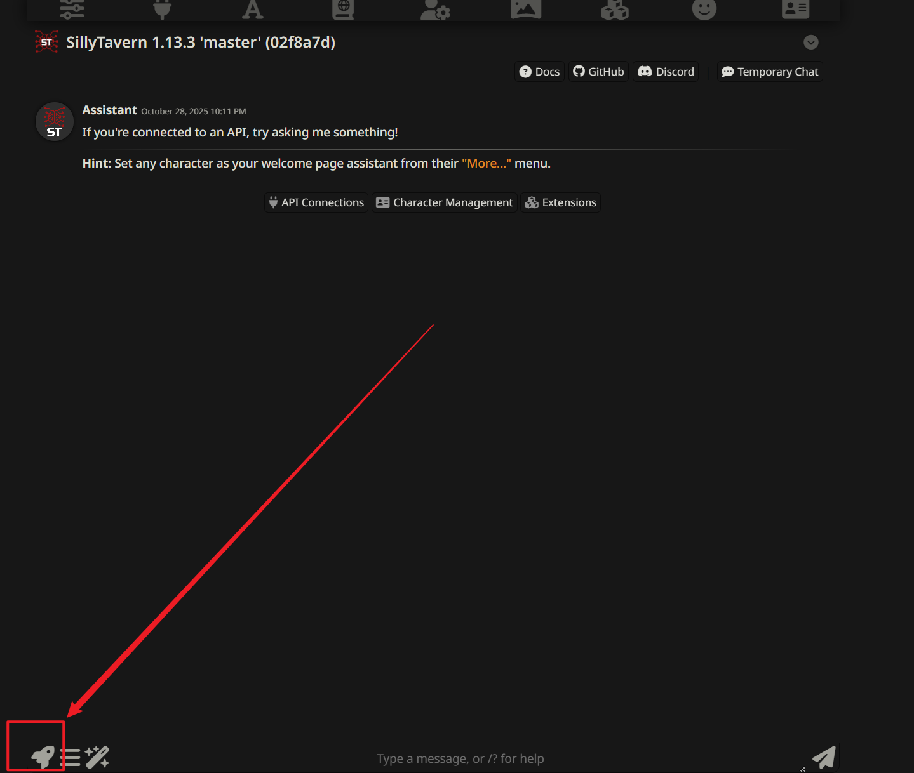

### Usage

1. Before this, you should first understand how to use ST. Prepare a character card and API connection.
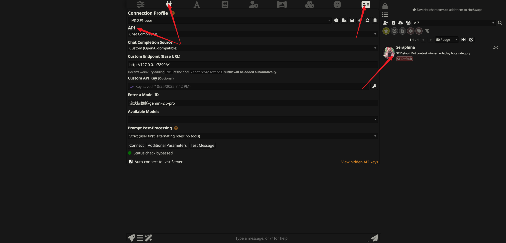
2. Convert the first message of the character card to OEOS script format
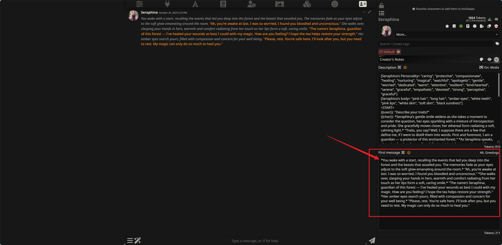
You can use AI to send the [OEOS Script Documentation](OEOScript_format_AI_zh.md) and your first message to AI, asking it to convert the first message to OEOS format and wrap it with <game>, <Pages>, <summary> tags. Like this:
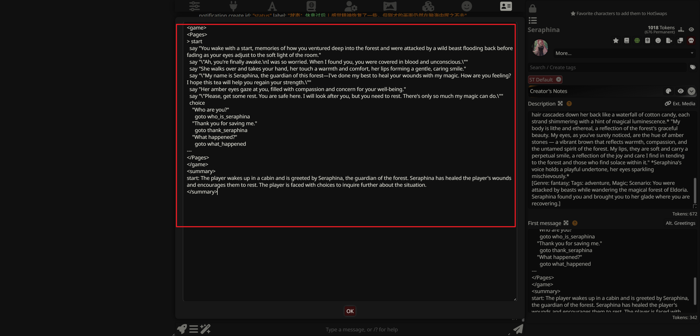
3. Click the rocket icon to the left of the input box to enter the character selection page and enable the character you just created.
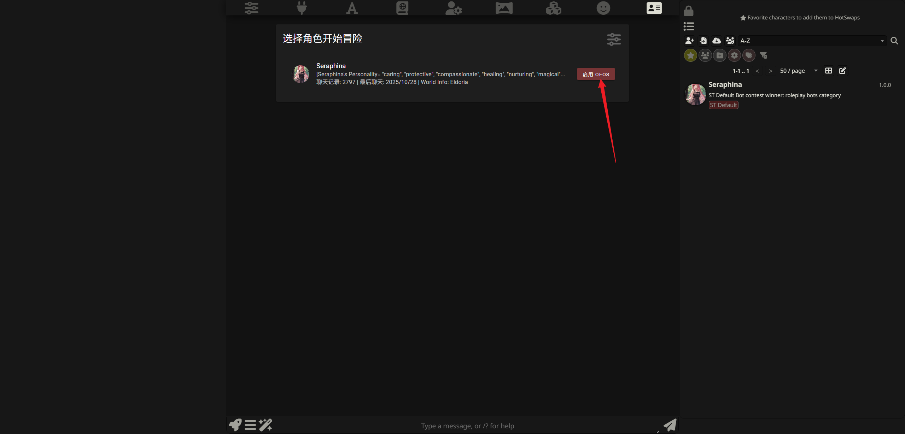
Then it turns green
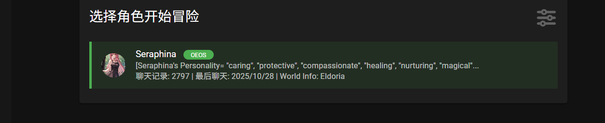
Click on the character to start playing

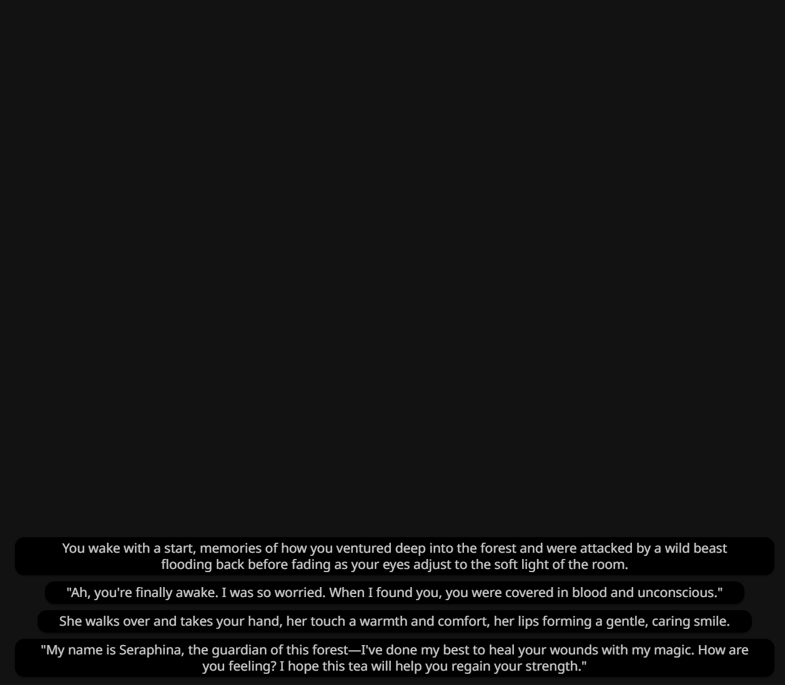


## How It Works (For Developers)

### Overall Flow

1. **Plugin Loading**
   - OEOS extension loads when SillyTavern starts
   - Injects OEOS game panel next to the chat interface

2. **AI Content Generation**
   - When AI responds, the plugin automatically extracts `<Pages>` and `<summary>` tags
   - These tags contain OEOS-formatted game content (dialogue, options, images, etc.)

3. **Data Persistence**
   - Extracted content is automatically saved to the character's dedicated World Info
   - Game progress can be continued the next time the chat is opened

4. **Game Rendering**
   - openOEOS player reads the saved content
   - Renders text-formatted OEOS scripts into an interactive game interface
   - Supports multimedia elements such as images, audio, video, timers, etc.

5. **Smart Pre-generation**
   - System can concurrently pre-generate multiple game pages (up to 10)
   - Prepares subsequent content in advance to reduce waiting time

### Technical Architecture

- **Frontend Player**: openOEOS player based on Vue 2 + Vuetify
- **Bridge Layer**: Connects SillyTavern and openOEOS, handles data extraction and synchronization
- **Concurrent Generator**: Utilizes SillyTavern's API to implement multi-page concurrent generation

## Core Module Description (For Developers)

### Plugin Core Files (located in oeos-st-extension/)

#### 1. Entry and Loading Modules

- **`manifest.json`**
  - SillyTavern extension manifest file
  - Defines extension name, version, author, entry file, and other metadata
  - Specifies `loader.js` as the extension loading entry

- **`loader.js`**
  - Extension loader, executed first when SillyTavern starts
  - Imports `index.js` to start the entire plugin

- **`index.js`**
  - Main entry file, initializes all modules

#### 2. UI and Interface Modules

- **`ui.js`**
  - Responsible for injecting OEOS game panel into SillyTavern interface
  - Implements switching logic between chat interface and game interface
  - Dynamically loads openOEOS player build artifacts (JS/CSS)
  - Creates toggle buttons, manages interface show/hide

#### 3. Core Bridge and API Modules

- **`plugin-bridge.js`**
  - Bridge layer core, connects SillyTavern and openOEOS player
  - Exposes `window.oeosApi` for Vue application calls
  - Provides the following main functions:
    - Game data management (via ElementDataManager)
    - Pre-generation system control
    - Chat history control
    - Preset auto-switching
    - Global settings management
  - Listens to AI response events, automatically extracts and saves game content

- **`st-api.js`**
  - SillyTavern API abstraction layer
  - Encapsulates access to SillyTavern core functions:
    - World Info read/write (`saveWi`, `loadWi`)
    - Event listening (`listenToAiResponse`)
    - Preset management (`getPresetByName`, `savePresetDirect`)
  - Provides unified error handling and logging

#### 4. Data Management Modules

- **`element-data-manager.js`**
  - Game data manager, serves as the single source of truth for OEOS game data
  - Manages the following data structures:
    - `pages`: Page content (Map: pageId -> content)
    - `summary`: Page summaries (Map: pageId -> abstract)
    - `graph`: Page relationship graph (Map: pageId -> [childIds])
    - `state`: Current game state
    - `dynamicContext`: Dynamic context
  - Functions:
    - Extract Pages and Summary from chat messages
    - Load game data from World Info
    - Incremental updates and debounced sync to World Info
    - Differential sync to preset files

- **`game-state.js`**
  - Game state management module
  - Responsible for reading/writing game state in World Info
  - Updates XML tag content in preset files (Graph, State, Dynamic-Context, Summary)
  - Provides page entry update functionality

- **`globalSettings.js`**
  - Global settings management module
  - Manages global switches for images, audio, etc.
  - Uses localStorage for persistent settings
  - Provides settings read, update, and reset functions

#### 5. Smart Generation Modules

- **`pregeneration.js`**
  - Pre-generation system core module
  - Listens to page change events, automatically triggers pre-generation
  - Analyzes current page's jump targets (goto statements)
  - Intelligently pre-generates ungenerated target pages (up to 10)
  - Manages generation queue and slot usage

- **`concurrent-generator.js`**
  - Concurrent generator V1 (quiet mode)
  - Uses SillyTavern's quiet mode for generation
  - Does not save to chat history
  - Supports 10 concurrent slots (xb1-xb10)

- **`concurrent-generator-v2.js`**
  - Concurrent generator V2 (saves to chat)
  - Manually adds messages to chat history
  - Generated content displays in chat interface
  - Supports 10 concurrent slots
  - Fully uses user's API configuration and presets

#### 6. Auxiliary Function Modules

- **`chat-history-control.js`**
  - Chat history control module
  - Provides functionality to enable/disable chatHistory in Prompt Manager
  - Used to temporarily disable chat history during pre-generation to avoid context pollution
  - Supports silent switching (no UI update trigger)

- **`preset-switcher.js`**
  - Preset auto-switching module
  - Automatically switches to OEOS-specific preset when switching characters
  - Saves and restores each character's previous preset
  - Uses PresetManager API for preset switching

- **`debug-context-comparison.js`**
  - Debug tool: context comparison
  - Compares context differences between concurrent generator and SillyTavern normal generation
  - Analyzes message arrays, character distribution, World Info inclusion
  - Exposes `window.debugContextComparison` for console debugging

#### 7. Configuration Files

- **`小猫之神-oeos.json`**
  - SPreset preset file
  - Contains prompt templates required for OEOS games
  - Defines XML tag structures such as Graph, State, Dynamic-Context, Summary
  - Needs to be imported into "Tavern Helper" SPreset for use

### Module Dependency Relationships

```
loader.js
  └─> index.js
       ├─> ui.js (inject interface)
       └─> plugin-bridge.js (bridge layer)
            ├─> st-api.js (ST API encapsulation)
            ├─> element-data-manager.js (data management)
            ├─> game-state.js (state management)
            ├─> globalSettings.js (global settings)
            ├─> chat-history-control.js (chat history control)
            ├─> preset-switcher.js (preset switching)
            └─> pregeneration.js (pre-generation system)
                 ├─> concurrent-generator.js (V1)
                 └─> concurrent-generator-v2.js (V2)
```
## Project Structure (For Developers)

```
src/
├── oeos-st-extension/             # Complete OEOS plugin (Git tracked)
│   ├── manifest.json              # Extension manifest file
│   ├── loader.js                  # Extension loader entry
│   ├── index.js                   # Main entry, initializes all modules
│   ├── ui.js                      # UI injection and interface switching logic
│   ├── plugin-bridge.js           # Bridge layer, exposes window.oeosApi
│   ├── st-api.js                  # SillyTavern API abstraction layer
│   ├── element-data-manager.js    # Game data manager (single source of truth)
│   ├── game-state.js              # Game state management (read/write World Info)
│   ├── globalSettings.js          # Global settings management (image/audio switches)
│   ├── chat-history-control.js    # Chat history control module
│   ├── preset-switcher.js         # Preset auto-switching logic
│   ├── pregeneration.js           # Pre-generation system core
│   ├── concurrent-generator.js    # Concurrent generator V1 (quiet mode)
│   ├── concurrent-generator-v2.js # Concurrent generator V2 (saves to chat)
│   ├── debug-context-comparison.js# Debug tool: context comparison
│   ├── 小猫之神-oeos.json         # SPreset preset file
│   └── README.md                  # Plugin documentation
│
├── openeos-master/                # openOEOS player (Vue 2 project)
│   ├── src/                       # Vue source code
│   ├── public/                    # Static resources
│   ├── dist/                      # Build output (not tracked)
│   ├── package.json               # Dependencies and build scripts
│   ├── vue.config.js              # Webpack configuration
│   ├── deploy.js                  # Deployment script (copy plugin + build)
│   └── README.md                  # openOEOS player documentation
│
├── SillyTavern-release/           # SillyTavern installation directory (not tracked)
│   └── public/scripts/extensions/third-party/
│       └── oeos-st-extension/     # Final deployment location (auto-generated)
│
├── package.json                   # Root project dependencies
├── README.md                      # English documentation (this file)
└── README_CN.md                   # Chinese documentation
```

## Build Instructions (For Developers)

### Environment Requirements

- Node.js 14+ and npm
- SillyTavern installed (located at `src/SillyTavern-release/`)

### Build Steps

1. **Install Dependencies**
   ```bash
   cd src/openeos-master
   npm install
   ```

2. **Build Project**
   ```bash
   npm run build
   ```

   The build process will automatically perform the following operations:
   - Compile openOEOS player using Vue CLI (output to `dist/`)
   - Execute `deploy.js` script
   - Copy complete plugin from `oeos-st-extension/`
   - Merge `dist/` build artifacts into the same folder

   Final output location:
   ```
   src/SillyTavern-release/public/scripts/extensions/third-party/oeos-st-extension/
   ```


### Build Notes

- No need to manually modify files in `SillyTavern-release/public/scripts/extensions/third-party/oeos-st-extension/` directory
- Plugin core files: modify in `oeos-st-extension/`
- Vue player code: modify in `openeos-master/src/`
- Each build automatically syncs latest code to SillyTavern extension directory

## Acknowledgments

- [openOEOS](https://github.com/fapnip/openeos) - Excellent open-source OEOS player
- 小猫之神 - Provided SPreset preset rules and examples

## License

This project follows the respective open-source licenses. See LICENSE files in each subproject for details.
