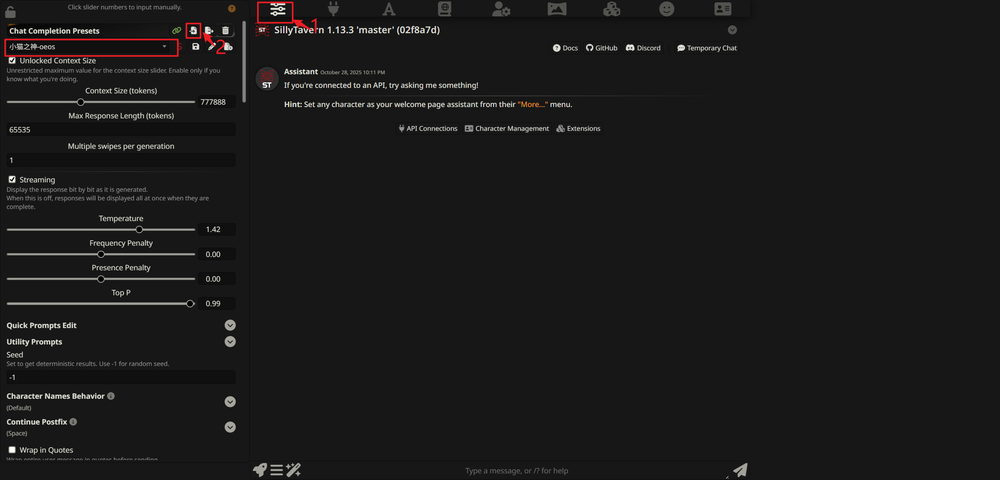
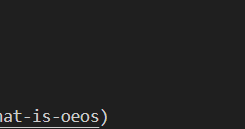
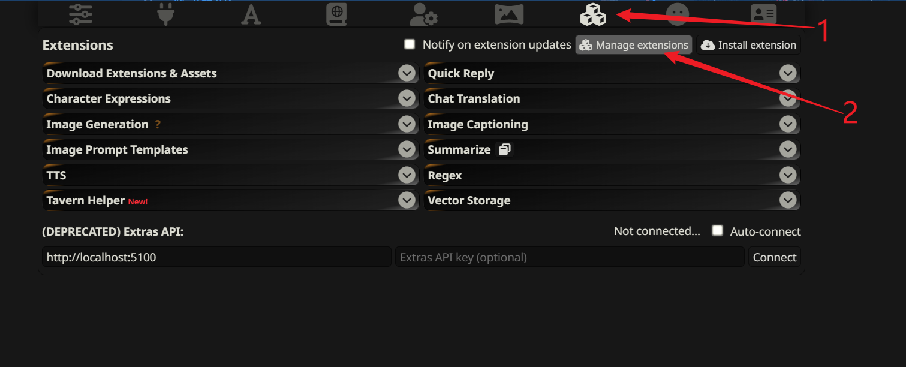

# OEOS 插件（SillyTavern 扩展）

[English](README.md) | 简体中文

**⚠️ 注意**

**本项目目前仍处于非常初级的阶段，功能尚不完善，可能存在许多未预见的 Bug。此外，项目中的所有代码均由 AI 生成，仅供技术验证和交流。请谨慎使用。**

包括这个文档的大部分内容也是AI生成的。
一个将 AI 对话转化为互动式 OEOS 游戏体验的 SillyTavern 扩展。

## 目录

- [什么是 OEOS？](#什么是-oeos)
- [什么是"基于 AI 的 OEOS"？](#什么是基于-ai-的-oeos)
- [安装方法](#安装方法)
- [工作原理](#工作原理)
- [核心模块说明](#核心模块说明)
- [项目结构](#项目结构)
- [构建方法](#构建方法)
- [致谢](#致谢)

## 什么是 OEOS？

**OEOS（Erotic Obedience Scripting）** 是一种互动式脚本格式，最初用于 Milovana 平台，可以创建包含对话、选择、图片、音频、视频、计时器等丰富交互元素的互动内容。

**openOEOS** 是由 fapnip 开发的开源 OEOS 播放器，可以在浏览器中运行 OEOS 脚本。

## 什么是"基于 AI 的 OEOS"？

本插件将 openOEOS 播放器集成到 SillyTavern 中，并实现了一个创新功能：

- **AI 自动生成 OEOS 内容**：大语言模型（LLM）的回复会被自动解析为 OEOS 页面和摘要
- **持久化存储**：生成的内容保存到角色的 World Info 中，可以随时读取和继续
- **可视化交互**：通过 openOEOS 播放器渲染，提供图形化的游戏体验
- **智能预生成**：支持并发预生成多个页面，提升体验流畅度


## 安装方法


### 前置条件

1. **安装酒馆助手**
   - 请先确保已安装"酒馆助手"插件
   - 参考链接https://n0vi028.github.io/JS-Slash-Runner-Doc/


2. **安装 SPreset 脚本**
   - 安装"酒馆助手脚本"中的【SPreset - 预设内置正则 | 宏嵌套…】
   - 参考链接：https://discord.com/channels/1134557553011998840/1407146985643053096


3. **导入预设文件**
   - 将 `oeos-st-extension/小猫之神-oeos.json` 导入到"酒馆助手"的 SPreset 中

   
   - 感谢预设作者：小猫之神
   - 参考链接：https://discord.com/channels/1134557553011998840/1402584661208858635


### 安装扩展

1. 将oeos-st-extension复制到你的 SillyTavern 安装目录：
   ```
   SillyTavern/public/scripts/extensions/third-party/oeos-st-extension/
   ```
   就像是这样：
   

2. 重启 SillyTavern

3. 在"扩展管理 > 第三方扩展"中启用 "OEOS Interface"



## 工作原理

### 整体流程

1. **插件加载**
   - SillyTavern 启动时加载 OEOS 扩展
   - 在聊天界面旁边注入 OEOS 游戏面板

2. **AI 生成内容**
   - 当 AI 回复时，插件自动提取其中的 `<Pages>` 和 `<summary>` 标签
   - 这些标签包含了 OEOS 格式的游戏内容（对话、选项、图片等）

3. **数据持久化**
   - 提取的内容自动保存到角色专属的 World Info 中
   - 下次打开聊天时可以继续之前的游戏进度

4. **游戏渲染**
   - openOEOS 播放器读取保存的内容
   - 将文本格式的 OEOS 脚本渲染为可交互的游戏界面
   - 支持图片、音频、视频、计时器等多媒体元素

5. **智能预生成**
   - 系统可以并发预生成多个游戏页面（最多 10 个）
   - 提前准备后续内容，减少等待时间

### 技术架构

- **前端播放器**：基于 Vue 2 + Vuetify 的 openOEOS 播放器
- **桥接层**：连接 SillyTavern 和 openOEOS，处理数据提取和同步
- **并发生成器**：利用 SillyTavern 的 API 实现多页面并发生成

## 核心模块说明（对于开发者）

### 插件核心文件（位于 oeos-st-extension/）

#### 1. 入口和加载模块

- **`manifest.json`**
  - SillyTavern 扩展清单文件
  - 定义扩展名称、版本、作者、入口文件等元数据
  - 指定 `loader.js` 为扩展加载入口

- **`loader.js`**
  - 扩展加载器，SillyTavern 启动时首先执行此文件
  - 导入 `index.js` 启动整个插件

- **`index.js`**
  - 主入口文件，初始化所有模块
  - 调用 `injectAndSetupSwapper()` 注入 UI
  - 导入 `plugin-bridge.js` 建立桥接层

#### 2. UI 和界面模块

- **`ui.js`**
  - 负责在 SillyTavern 界面中注入 OEOS 游戏面板
  - 实现聊天界面和游戏界面的切换逻辑
  - 动态加载 openOEOS 播放器的构建产物（JS/CSS）
  - 创建切换按钮，管理界面显示/隐藏

#### 3. 核心桥接和 API 模块

- **`plugin-bridge.js`**
  - 桥接层核心，连接 SillyTavern 和 openOEOS 播放器
  - 暴露 `window.oeosApi` 供 Vue 应用调用
  - 提供以下主要功能：
    - 游戏数据管理（通过 ElementDataManager）
    - 预生成系统控制
    - 聊天历史控制
    - 预设自动切换
    - 全局设置管理
  - 监听 AI 回复事件，自动提取和保存游戏内容

- **`st-api.js`**
  - SillyTavern API 抽象层
  - 封装对 SillyTavern 核心功能的访问：
    - World Info 读写（`saveWi`, `loadWi`）
    - 事件监听（`listenToAiResponse`）
    - 预设管理（`getPresetByName`, `savePresetDirect`）
  - 提供统一的错误处理和日志记录

#### 4. 数据管理模块

- **`element-data-manager.js`**
  - 游戏数据管理器，作为 OEOS 游戏数据的单一数据源
  - 管理以下数据结构：
    - `pages`: 页面内容（Map: pageId -> content）
    - `summary`: 页面摘要（Map: pageId -> abstract）
    - `graph`: 页面关系图（Map: pageId -> [childIds]）
    - `state`: 当前游戏状态
    - `dynamicContext`: 动态上下文
  - 功能：
    - 从聊天消息中提取 Pages 和 Summary
    - 从 World Info 加载游戏数据
    - 增量更新和防抖同步到 World Info
    - 差异化同步到预设文件

- **`game-state.js`**
  - 游戏状态管理模块
  - 负责读写 World Info 中的游戏状态
  - 更新预设文件中的 XML 标签内容（Graph、State、Dynamic-Context、Summary）
  - 提供页面条目更新功能

- **`globalSettings.js`**
  - 全局设置管理模块
  - 管理图片、音频等全局开关
  - 使用 localStorage 持久化设置
  - 提供设置的读取、更新、重置功能

#### 5. 智能生成模块

- **`pregeneration.js`**
  - 预生成系统核心模块
  - 监听页面变更事件，自动触发预生成
  - 分析当前页面的跳转目标（goto 语句）
  - 智能预生成未生成的目标页面（最多 10 个）
  - 管理生成队列和槽位使用

- **`concurrent-generator.js`**
  - 并发生成器 V1（quiet 模式）
  - 使用 SillyTavern 的 quiet 模式生成
  - 不保存到聊天记录
  - 支持 10 个并发槽位（xb1-xb10）

- **`concurrent-generator-v2.js`**
  - 并发生成器 V2（保存到聊天）
  - 手动添加消息到聊天历史
  - 生成的内容显示在聊天界面
  - 支持 10 个并发槽位
  - 完全使用用户的 API 配置和预设

#### 6. 辅助功能模块

- **`chat-history-control.js`**
  - 聊天历史控制模块
  - 提供开启/关闭 Prompt Manager 中 chatHistory 的功能
  - 用于预生成时临时禁用聊天历史，避免上下文污染
  - 支持静默切换（不触发 UI 更新）

- **`preset-switcher.js`**
  - 预设自动切换模块
  - 在切换角色时自动切换到 OEOS 专用预设
  - 保存和恢复每个角色的上一个预设
  - 使用 PresetManager API 进行预设切换

- **`debug-context-comparison.js`**
  - 调试工具：上下文对比
  - 对比并发生成器和 SillyTavern 正常生成的上下文差异
  - 分析消息数组、角色分布、World Info 包含情况
  - 暴露 `window.debugContextComparison` 供控制台调试

#### 7. 配置文件

- **`小猫之神-oeos.json`**
  - SPreset 预设文件
  - 包含 OEOS 游戏所需的提示词模板
  - 定义 Graph、State、Dynamic-Context、Summary 等 XML 标签结构
  - 需要导入到"酒馆助手"的 SPreset 中使用

### 模块依赖关系

```
loader.js
  └─> index.js
       ├─> ui.js (注入界面)
       └─> plugin-bridge.js (桥接层)
            ├─> st-api.js (ST API 封装)
            ├─> element-data-manager.js (数据管理)
            ├─> game-state.js (状态管理)
            ├─> globalSettings.js (全局设置)
            ├─> chat-history-control.js (聊天历史控制)
            ├─> preset-switcher.js (预设切换)
            └─> pregeneration.js (预生成系统)
                 ├─> concurrent-generator.js (V1)
                 └─> concurrent-generator-v2.js (V2)
```
## 项目结构

```
src/
├── oeos-st-extension/             # 完整的 OEOS 插件（Git 跟踪）
│   ├── manifest.json              # 扩展清单文件
│   ├── loader.js                  # 扩展加载器入口
│   ├── index.js                   # 主入口，初始化所有模块
│   ├── ui.js                      # UI 注入和界面切换逻辑
│   ├── plugin-bridge.js           # 桥接层，暴露 window.oeosApi
│   ├── st-api.js                  # SillyTavern API 抽象层
│   ├── element-data-manager.js    # 游戏数据管理器（单一数据源）
│   ├── game-state.js              # 游戏状态管理（读写 World Info）
│   ├── globalSettings.js          # 全局设置管理（图片/音频开关）
│   ├── chat-history-control.js    # 聊天历史控制模块
│   ├── preset-switcher.js         # 预设自动切换逻辑
│   ├── pregeneration.js           # 预生成系统核心
│   ├── concurrent-generator.js    # 并发生成器 V1（quiet 模式）
│   ├── concurrent-generator-v2.js # 并发生成器 V2（保存到聊天）
│   ├── debug-context-comparison.js# 调试工具：上下文对比
│   ├── 小猫之神-oeos.json         # SPreset 预设文件
│   └── README.md                  # 插件文档
│
├── openeos-master/                # openOEOS 播放器（Vue 2 项目）
│   ├── src/                       # Vue 源代码
│   ├── public/                    # 静态资源
│   ├── dist/                      # 构建输出（不跟踪）
│   ├── package.json               # 依赖和构建脚本
│   ├── vue.config.js              # Webpack 配置
│   ├── deploy.js                  # 部署脚本（复制插件 + 构建）
│   └── README.md                  # openOEOS 播放器文档
│
├── SillyTavern-release/           # SillyTavern 安装目录（不跟踪）
│   └── public/scripts/extensions/third-party/
│       └── oeos-st-extension/     # 最终部署位置（自动生成）
│
├── package.json                   # 根项目依赖
├── README.md                      # 英文文档
└── README_CN.md                   # 中文文档（本文件）
```

## 构建方法

### 环境要求

- Node.js 14+ 和 npm
- 已安装 SillyTavern（位于 `src/SillyTavern-release/`）

### 构建步骤

1. **安装依赖**
   ```bash
   cd src/openeos-master
   npm install
   ```

2. **构建项目**
   ```bash
   npm run build
   ```

   构建过程会自动执行以下操作：
   - 使用 Vue CLI 编译 openOEOS 播放器（输出到 `dist/`）
   - 执行 `deploy.js` 脚本
   - 从 `oeos-st-extension/` 复制完整的插件
   - 将 `dist/` 构建产物合并到同一文件夹

   最终输出位置：
   ```
   src/SillyTavern-release/public/scripts/extensions/third-party/oeos-st-extension/
   ```


### 构建说明

- 不需要手动修改 `SillyTavern-release/public/scripts/extensions/third-party/oeos-st-extension/` 目录下的文件
- 插件核心文件：在 `oeos-st-extension/` 中修改
- Vue 播放器代码：在 `openeos-master/src/` 中修改
- 每次构建会自动同步最新代码到 SillyTavern 扩展目录

## 致谢

- [openOEOS](https://github.com/fapnip/openeos) - 优秀的开源 OEOS 播放器
- 小猫之神 - 提供 SPreset 预设规则和示例

## 许可证

本项目遵循相应的开源许可证，详见各子项目的 LICENSE 文件。

